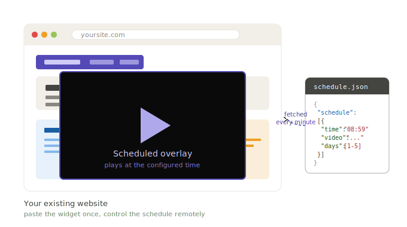

# Web Video Scheduler
> A drop-in widget that adds a scheduled video overlay to any website. Paste one snippet, edit a JSON file, and your site plays full-screen video at exact times. No backend, no build step, no dependencies.



Built and battle-tested on a real 24/7 signage installation. Originally written to play a daily promo on a wall-mounted TV; works equally well as a scheduled banner/popup on any regular website.

---

## How it works in 3 steps

1. **Paste the widget** snippet into your existing site (just before `</body>`)
2. **Host a `schedule.json` file** somewhere your site can reach
3. **Edit `schedule.json`** anytime — change times, videos, target screens — without touching the page

```
┌──────────────────────────────┐
│  Your existing website       │
│  ┌────────────────────────┐  │
│  │  Your normal content   │  │
│  └────────────────────────┘  │
│           +                  │
│  <widget snippet pasted>     │  ← one-time integration
└──────────────┬───────────────┘
               │ fetches every minute
               ▼
        ┌─────────────┐
        │schedule.json│              ← edit anytime, page picks it up
        │  + videos   │
        └─────────────┘
```

All scheduling logic runs **client-side in the browser**. No cron, no daemon, no server-side scheduler. The page checks the current time every second and plays the configured video full-screen when a scheduled time matches.

## Quick start

### 1. Paste the widget

Open [`widget.html`](widget.html), copy the entire contents, and paste it **just before the closing `</body>` tag** of your existing HTML page.

That's the only change to your site.

### 2. Set the config URL

In the snippet you just pasted, find this line:

```javascript
const CONFIG_URL = 'https://your-server.example.com/schedule.json';
```

Change the URL to point to where you'll host your schedule file.

### 3. Host the schedule

Upload [`schedule.example.json`](schedule.example.json) to that URL. Edit it to set your own times and video URLs:

```json
{
  "schedule": [
    {
      "time": "08:59",
      "days": [0, 1, 2, 3, 4, 5, 6],
      "screens": ["all"],
      "video_url": "https://your-server.com/videos/morning.mp4",
      "max_duration_sec": 240
    }
  ]
}
```

That's it. See [`docs/SCHEDULE-FORMAT.md`](docs/SCHEDULE-FORMAT.md) for the full schema (multiple slots, day-of-week filtering, multi-screen support).

## Why a JSON schedule

Once the widget is integrated, **you never need to touch the website code again**. All schedule changes happen by editing the JSON:

- Add a new time slot → add one object to the array
- Remove a slot → delete it
- Change a video → swap the URL
- Holiday override → comment out a slot
- Different content per location → use the `screens` field

The JSON is the remote control for your scheduled content.

## Examples

Two ready-to-use HTML pages in [`examples/`](examples/):

- **[`standalone.html`](examples/standalone.html)** — a minimal blank page with the widget already embedded. Use as-is for kiosk/TV setups where the page itself doesn't need to show anything else.
- **[`with-iframe.html`](examples/with-iframe.html)** — pulls in another website via iframe as base content, with the widget playing overlays on top. The original kiosk use case (live dashboard + scheduled promo).

For nginx kiosk deployments, see [`examples/nginx-tv.conf`](examples/nginx-tv.conf) and the integration guide in [`docs/INTEGRATION.md`](docs/INTEGRATION.md).

## Battle-tested fixes

This widget looks simple, but the simplicity took weeks of debugging on real kiosk hardware. The three non-obvious problems and how they're solved are documented in detail in [`docs/BATTLE-TESTED-FIXES.md`](docs/BATTLE-TESTED-FIXES.md). Short version:

1. **Audio autoplay on Android kiosk browsers** — solved via Web Audio API silent-oscillator priming on first user interaction.
2. **Audio leak that survives the Web Audio API fix** — solved by creating the `<video>` element dynamically only at playback time, then destroying it afterwards. Between plays there is no `<video>` in the DOM for the browser to mishandle.
3. **Re-authorization burden from frequent reloads** — the snippet doesn't reload the page; if your kiosk page needs a periodic reload for other reasons, do it weekly, not daily.

These are the difference between "demo works on my laptop" and "runs 24/7 in production for months." That's the actual value of this repo — not the lines of code, but the *right* lines of code.

## What's possible to build on top

The simple foundation extends naturally. Things mapped out, prototyped, or built in variations:

### Scheduling
- **Recurring + one-off mix** — base schedule plus dated overrides
- **Timezone-aware scheduling** for multi-region deployments
- **Holiday overrides** loaded from a separate file or calendar API
- **Per-screen schedules** managed in one config (already supported via `screens` field — extend the JSON)

### Content
- **Multiple video overlays** rotated by schedule or randomly
- **Image overlays** for static promotional content
- **HTML overlays** — animated banners, news tickers, weather widgets
- **Live streaming** instead of pre-recorded files

### Management
- **Web UI for non-technical staff** to edit the JSON schedule
- **Audit log** of what played when, useful for compliance
- **Health monitoring** with alerts when a display drops offline
- **Centralized media library** with per-display selection

### Integration
- **CMS plugins** (WordPress, Shopify) so site owners can add the widget in one click
- **Telegram/Slack bot** that updates the schedule remotely
- **A/B testing** different videos at the same time slot
- **Analytics** — track views, completions, drop-offs

If any of this sounds useful for your project — see **Consulting** below.

## Consulting

This project came out of a real production installation, so the tricky parts (kiosk browser quirks, audio unlock on Android TV, scheduling edge cases, integration with existing sites) are already mapped out.

**Free scoping call** — happy to spend 20–30 minutes understanding your setup and telling you honestly whether this widget fits, what's needed to adapt it, and roughly how much work it is. No obligation either way.

**Paid integration & customization** — if you want help embedding this into your existing site, setting up the JSON config, hosting the schedule infrastructure, or building any of the extensions above, I do this professionally:

- One-off integration into your site (typically 2–4 hours)
- Custom features (multi-screen management, web UI, monitoring)
- Full turnkey kiosk install with hardware recommendations
- Maintenance & on-call for high-stakes signage deployments

Reach out:

- **Telegram**: https://t.me/Boeing911

— Boeing

## Known limitations (honest list)

- **Client-side scheduling**: if the user's clock drifts, the schedule drifts with it. Mitigate by syncing NTP on the display device.
- **Single video at a time**: by design — overlapping schedules trigger only the first matching slot.
- **No web UI for editing the schedule**: it's a JSON file. Edit it in any text editor, or build a UI on top (extension territory).
- **No authentication on `schedule.json`**: whoever can read the file URL can see your schedule. Host behind a reverse proxy with auth if that matters.
- **Audio unlock requires one human tap** per page load. For digital signage, that's once per reload cycle.

## Contributing

PRs welcome — see [CONTRIBUTING.md](CONTRIBUTING.md). For feature requests and questions, open an issue or a discussion.

## License

MIT — see [LICENSE](LICENSE). Use it however you want, commercially or otherwise.
